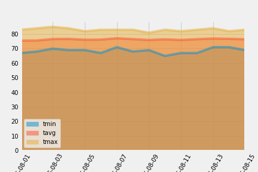

# Climate_Vacation
## Goal:
Analyze the wheater conditions prior to a vacations

## Resourses used:
* Python / Jupiter
  * Pandas / SQL
  * Numpy
  * Matplotlib
  * SQLalquemy
  
## Output:
Based on the last year same date:
Excelent wheater conditions for the selected 2 weeks.

